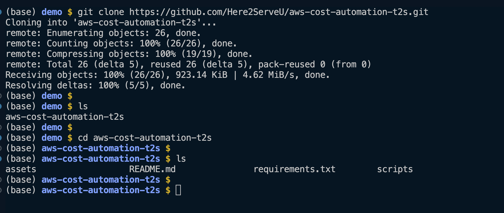
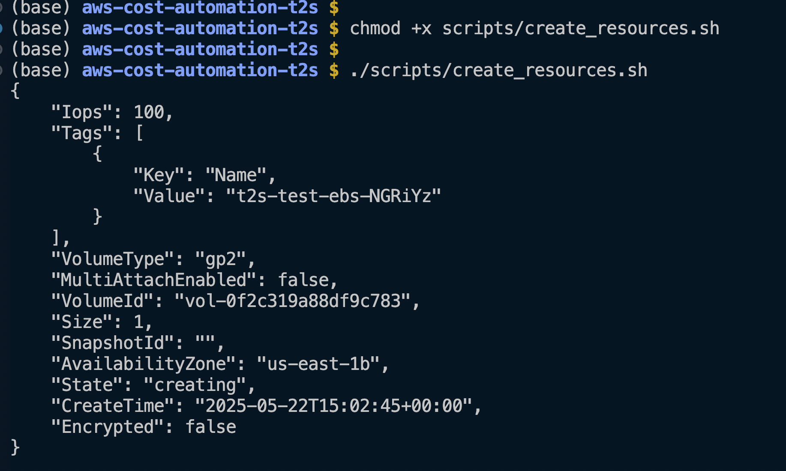
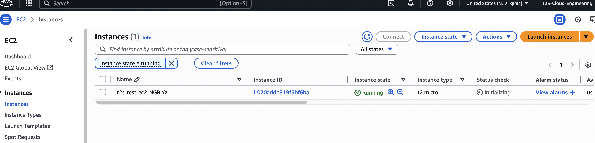
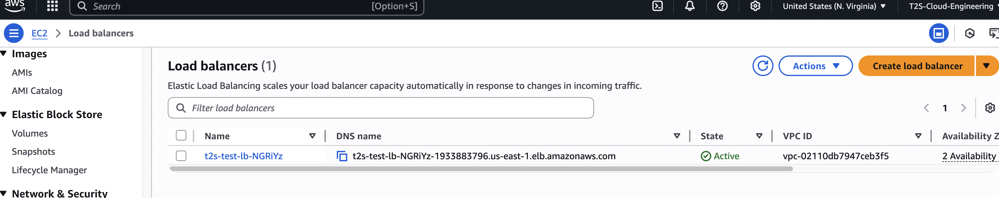
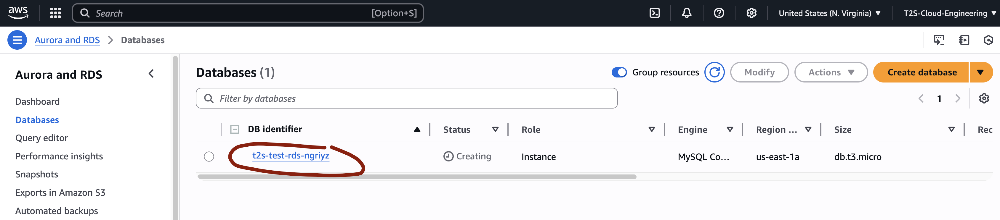
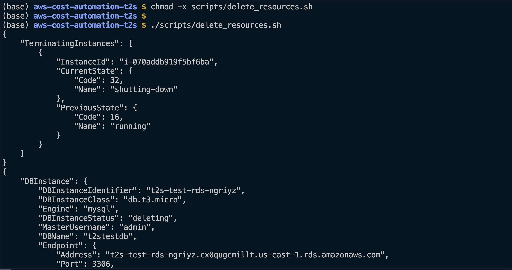
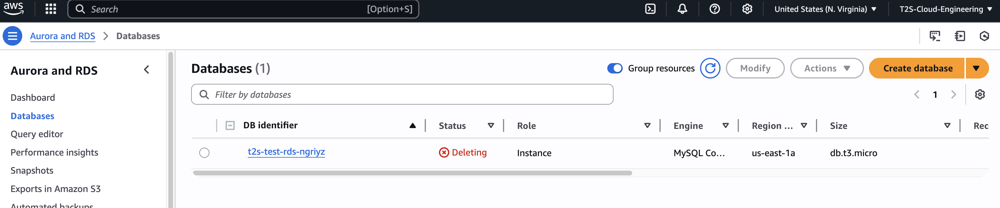

# AWS Cost Automation – T2S Test Environment

This repository contains scripts to automate the creation and cleanup of cost-driving AWS resources used for development, testing, and training.

The scripts are tools I use to automate the creation and cleanup of unwanted resources to help my clients reduce spending as they use Cloud services.
 

## Features

- Create & destroy **EC2, EBS, EIP, RDS, S3, ALB**, or other Cloud resources
- Uses naming convention: `t2s-test-*`
- Works with **Python (`boto3`)** and **Bash (AWS CLI)**
- Modular automation for DevOps and Cloud teams

## Setup

```bash
git clone https://github.com/Here2ServeU/aws-cost-automation-t2s.git
cd aws-cost-automation-t2s
python3 -m venv venv && source venv/bin/activate
pip install -r requirements.txt
```

Create a `.env` file from `.env.example` and export AWS credentials.

## Scripts

| Task              | Bash                         | Python                          |
|------------------|------------------------------|----------------------------------|
| Create Resources | `scripts/create_resources.sh` | `scripts/create_resources.py`    |
| Cleanup Resources| `scripts/delete_resources.sh` | `scripts/delete_resources.py`    |

## Demo One: Using Bash Shell scripts To Create and Cleanup AWS Resources 

```bash
# Make the script executable
chmod +x scripts/create_resources.sh
chmod +x scripts/delete_resources.sh

# Run the script
./scripts/create_resources.sh
./scripts/delete_resources.sh
```

#### Step 1: Get The Code from GitHub
- Git Clone the Repository from my GitHub.
- Move into the Directory that has all the code.



#### Step 2: Run The Scripts
- Creating the resources to clean up later. 
- Make the scripts executable. 
- Run the scripts




#### Step 3: Validate the Creation of The Resources on the Console
- Creating for the sake of our Demo.
- At work, we will presume the existence of these resources. 
> Checking the existence of the EC2 instance! 


> Checking the existence of Load Balancers! 


> Checking the existence of Databases! 



#### Step 4: Cleaning Up for Cost Optimization
- Repeat the steps above: 
> - Making the script executable for clean up. 
> - Running the script
> - Validate on the Console 



> Checking the deletion of the EC2 instance! 


> Checking the deletion of the Databases! 


---
## Demo Two: Using Python scripts To Create and Cleanup AWS Resources

```bash
# Step 1: Set up a Python virtual environment (recommended)
python3 -m venv venv
source venv/bin/activate

# Step 2: Install dependencies
pip install -r requirements.txt

# Step 3: Configure AWS credentials (if not already set)
aws configure

# Step 4: Run the create script
python scripts/create_resources.py

# Step 5: When done, run the cleanup script
python scripts/delete_resources.py
```

---
## <div align="center">About the Author</div>

<div align="center">
  
</div>

**Emmanuel Naweji** is a **seasoned Cloud, DevOps, and SRE Engineer** with years of experience helping companies architect and deploy secure, scalable infrastructure. He is the founder of initiatives that train and mentor individuals seeking careers in IT and has helped hundreds transition into Cloud, DevOps, and Infrastructure roles.

- Book a free consultation: [https://here4you.setmore.com](https://here4you.setmore.com)
- Connect on LinkedIn: [https://www.linkedin.com/in/ready2assist/](https://www.linkedin.com/in/ready2assist/)

Let's connect and discuss how I can help you build reliable, automated infrastructure the right way.

---

MIT License © 2025 Emmanuel Naweji

You are free to use, copy, modify, merge, publish, distribute, sublicense, or sell copies of this software and its associated documentation files (the “Software”), provided that the copyright and permission notice appears in all copies or substantial portions of the Software.

This Software is provided “as is,” without any warranty — express or implied — including but not limited to merchantability, fitness for a particular purpose, or non-infringement. In no event will the authors be liable for any claim, damages, or other liability arising from the use of the Software.
